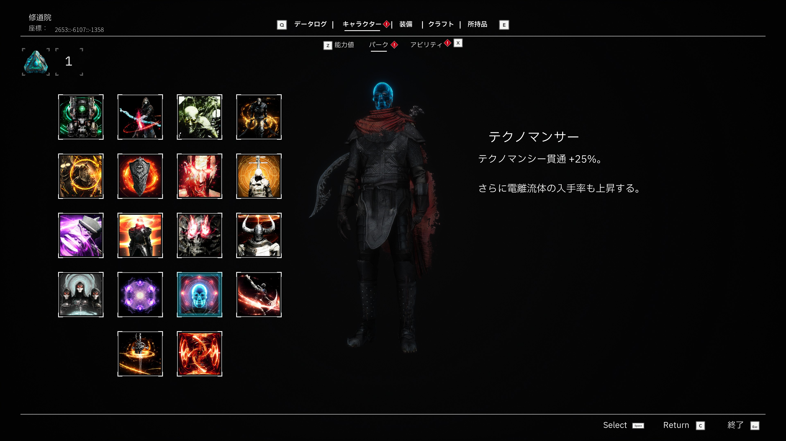
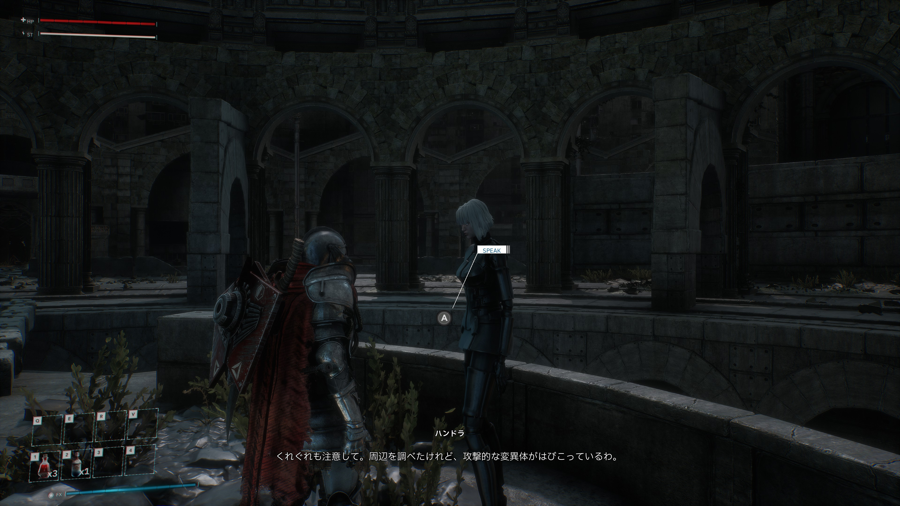

# Bleak Faith: Forsaken 日本語化MOD（非公式）

> **Unofficial Japanese localization patch for Bleak Faith: Forsaken (UE4.27).**
> Drop `BleakFaithForsaken_JP_P.pak` into the game's `Forsaken/Content/Paks/~mods/` folder.
> **This MOD contains no game files (none are distributed).** It is an unofficial patch that distributes only the translation data. A legitimate copy of **Bleak Faith: Forsaken** is required to play.

UE4.27製アクションRPG **Bleak Faith: Forsaken**（Archangel Studios）向けの非公式日本語化パッチです。ゲーム本体に **pakを被せる**形式で動作し、本体ファイルは書き換えません。

**本MODはゲーム本体ファイルを含みません（配布していません）。** 翻訳用の差分データのみを配布する非公式パッチです。プレイには別途、正規版の **Bleak Faith: Forsaken** が必要です。

---

## スクリーンショット





---

## 動作環境

- **対象ゲーム**: Bleak Faith: Forsaken（Steam版で動作確認）
- **プラットフォーム**: Windows
- **エンジン**: Unreal Engine 4.27

---

## インストール

1. 配布zipを **任意の場所に展開**（中身のファイルは互いに参照するため、`deploy.bat` だけを取り出さないでください）
2. 展開フォルダの **`deploy.bat` をダブルクリック**
3. UAC（ユーザーアカウント制御）の確認が出たら **「はい」** を選択 — 管理者権限が必要です
4. Steamインストール先を自動検出し、`BleakFaithForsaken_JP_P.pak` を以下にコピーします（`~mods` が無ければ自動作成）：
   ```
   <ゲームインストール先>\Forsaken\Content\Paks\~mods\BleakFaithForsaken_JP_P.pak
   ```
5. ゲームを起動

### 自動検出に失敗したら（手動インストール）

Steam以外でインストールした場合や、自動検出に失敗した場合は手動で配置できます：

1. ゲームのインストール先を開く（例：`C:\Program Files (x86)\Steam\steamapps\common\Bleak Faith Forsaken\`）
2. `Forsaken\Content\Paks\` の直下に **`~mods` フォルダ** を作成（既にあればそのまま使う）
3. `BleakFaithForsaken_JP_P.pak` を `~mods\` の中にコピー

---

## アンインストール

`<ゲームインストール先>\Forsaken\Content\Paks\~mods\BleakFaithForsaken_JP_P.pak` を削除するだけで元の英語表記に戻ります。本体ファイルは変更されていないため、ゲームの再インストールは不要です。

---

## クレジット

- **ゲーム本体**: Bleak Faith: Forsaken © Archangel Studios
- **翻訳・MOD制作**: solidpearls
- **同梱ツール**（ライセンス全文は [THIRD_PARTY_LICENSES.md](./THIRD_PARTY_LICENSES.md) を参照）:
  - [repak](https://github.com/trumank/repak) — UE pakファイルのパック/アンパック（MIT License）

本MODはファンによる非公式パッチであり、Archangel Studios・Playstack 等のパブリッシャーとは無関係です。
